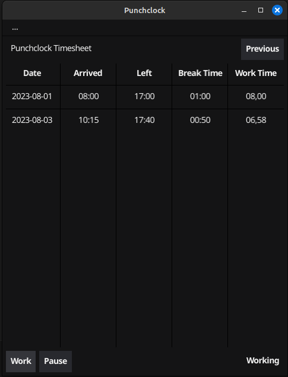

# punchclock
Desktop application written in Go that assists user in recording work time.



Copyright (C) Martin Olausson 2023

# Install
TBD

# Build from source
1. Install the Fyne toolkit according to https://developer.fyne.io/started/
2. Clone this repo
3. In repo root execute
```
go build
```

# Run tests
In repo root execute
```
go test github.com/simmarn/punchclock/test
```